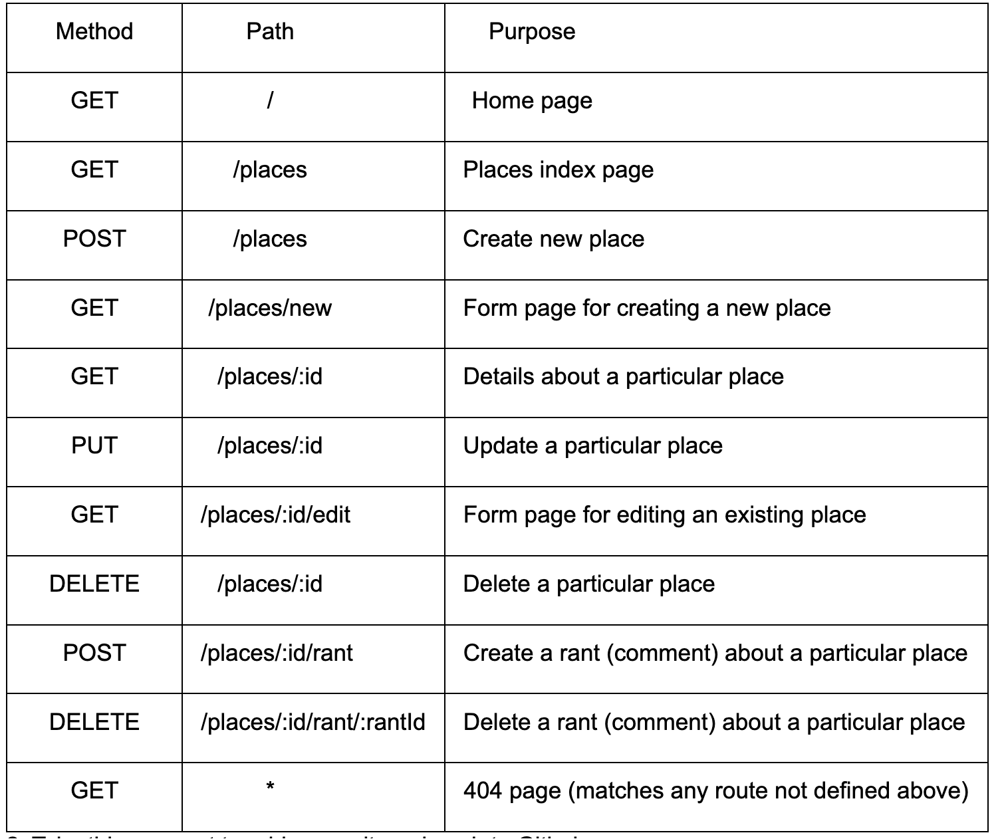

# Project REST-Rant

REST-Rant is an app where users can review restaurants.

we'll be storing for places (restaurants). You can choose whether to do this in a list, table, or other format.

Your places should have a name (string), city (string), state (string), cuisines (string) and a pic (string)

